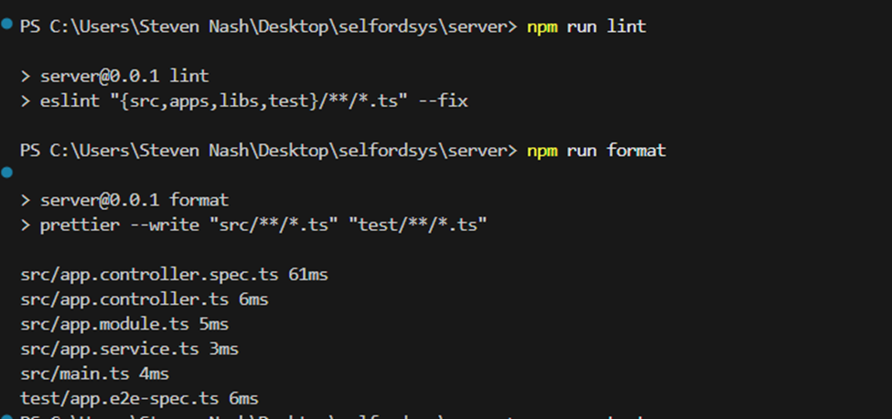
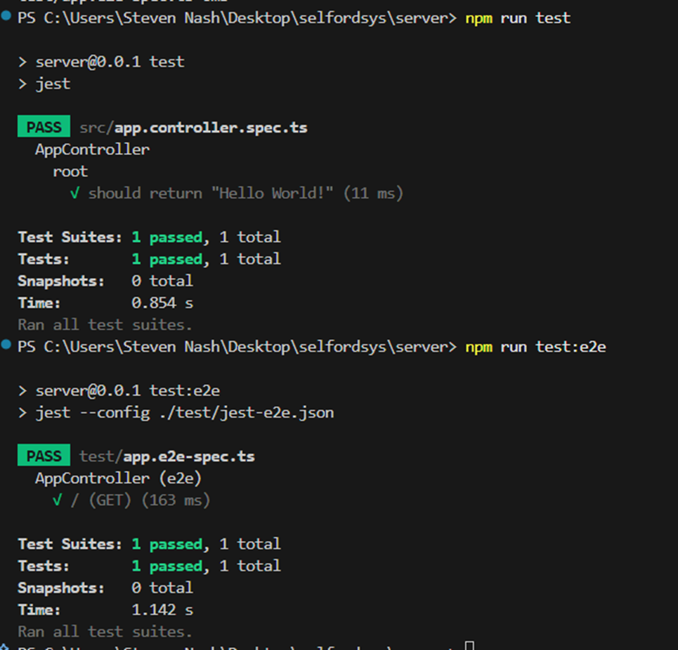

# 🚀 NestJS Server Initialization

This repository contains the backend **server** built using **NestJS**, configured with multi-environment support, code-quality tooling, testing foundations, and a team-approved project structure.

---

## 📘 Environment Setup

The project supports the following environments:

- `development`
- `staging`
- `production`

Environment variables are automatically loaded depending on the value of `NODE_ENV`.

Create the following files in the project root:

```
.env.development
.env.staging
.env.production
```


Refer to the `.env.example` file for a complete list of required variables.

---

## 📄 `.env.example`

```env
NODE_ENV=development
APP_PORT=5000

NODE_ENV=development
APP_PORT=5000

DB_HOST=your_db_host_here
DB_PORT=your_db_port_here
DB_USERNAME=your_db_username_here
DB_PASSWORD=your_db_password_here
DB_NAME=your_db_name_here

# Use long random strings for JWT secrets
JWT_ACCESS_SECRET=example_access_secret_1234567890abcdef
JWT_ACCESS_TTL=1800

JWT_REFRESH_SECRET=example_refresh_secret_abcdef1234567890
JWT_REFRESH_TTL=604800

# Example session secret
SESSION_SECRET=example_session_secret_9876543210abcdef
SESSION_TTL=86400000

# Allowed frontend origin
CORS_ORIGIN=http://localhost:3000
```

---
## 💻 To run the application/server

```
npm run start:dev
```

---
## 📈 To migrate

```
npm run typeorm -- migration:run
```

---
# Test run

```
npm run lint

npm run format

npm run test

npm run test:e2e
```

---
# Image Showing Test Run (For the initial set-up)




